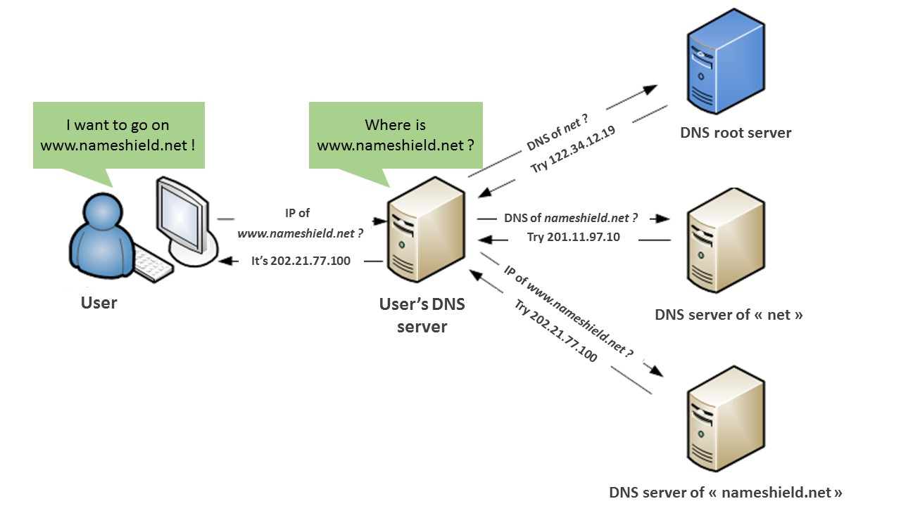
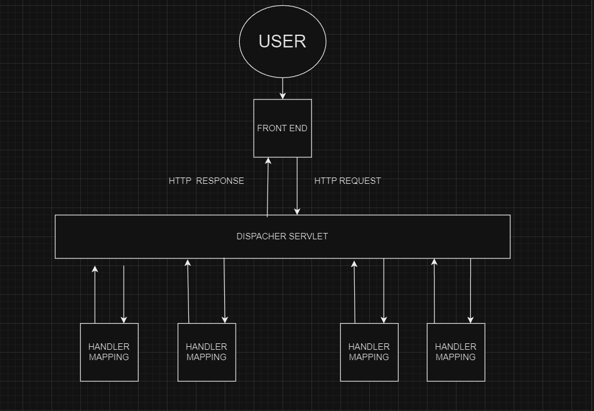

### PROBLEM STATEMENT
Given a domain url one need to generate the wrapper url that domain sheilds.
### POSSIBLE SOLUTIONS THAT WAS EXPECTING (or) THE NORMAL APPROACH
Urls can be generated starts normally by creating an dummy IP address (Internet Protocal) by grouping together a array of byte type 
along with a dummy port number, dummy path inorder to provide a decent looking url.

These can be put into a hashtable or a array in backend where they can concatenate within themselves trough randomly generated Indexs.

Here is what it looks like :

class RandomUrlGenerated {

     public static String getRandomURL() {
        return "http://" + getRandomAlphaString(3) + "."
                + getRandomAlphaString(10) + ".com/"
                + getRandomAlphaString(getRandomInt(3, 10));
    }//from  w  ww.  ja  va 2  s  .  c om

    public static String getRandomAlphaString(int length) {
        StringBuilder b = new StringBuilder();
        for (int i = 0; i < length; i++) {
            //   ascii 60 to 90
            char str = (char) (65 + (int) (Math.random() * (90 - 65)));
            b.append(str);
        }

        return b.toString();
    }

    public static int getRandomInt() {
        return getRandomInt(1, Integer.MAX_VALUE);
    }

    public static int getRandomInt(int min, int max) {
        return min + (int) ((Math.random() * (max - min)));
    }

}

### IMPROVIZING THE PROBLEM STATEMENT

The real world application of this problem is some what similar to the operation of DNS where based on our current location it is redirected to nearest operating server.

### THOUGTH PROCESS
So this the implementation that I am presenting that in a way demonstrates it.

### PROCESS
- for data I have gathered of 50 full fledged but dummy uri's along with their port, end point and most importantly their location.
- Now instead of taking only domain url name as input along with a drop down for location
- based on the location we query the full fledged uri's present in db in our case it is mongo db
 
 

 ### ARCHITECTURE

 

 ### DATABASE INTERACTIONS

             +------------------+
            |    Controllers   |   (REST API endpoints)
            +------------------+
                     |
        +----------------------------+
        |                            |
+---------------+          +------------------+
|    Services   |          |    Repositories   |
+---------------+          +------------------+
         |                           |
   +-----------+            +------------------+
   |   Models  |            |     MongoDB     |
   +-----------+            +------------------+
                                        |
                                +------------------+
                                |    MongoDB DB    |
                                +------------------+

### FRONTEND VIEW

